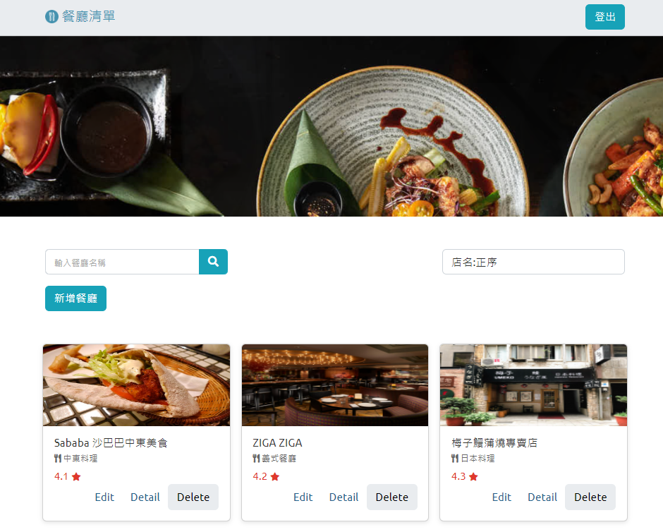

# Restaurant List

## 專案呈現畫面




## 功能描述 (features)

- 使用者註冊: 使用者可透過輸入姓名、Email、密碼、確認密碼進行註冊
- 使用者登入:
  - 使用者可透過 Email、密碼登入才可看見自己餐廳清單
  - 使用者可透過 Facebook 帳號進行登入
- 登入後功能:
  - 在首頁可看到個人的餐廳清單
  - 可針對餐廳名稱和類別進行搜尋
  - 點選 Detail 按鈕，會列出餐廳詳細資料，包括名稱、電話、地址、圖片、類別與 Google 地圖
  - 新增餐廳資料
  - 編輯餐廳資料
  - 刪除餐應資料
  - 可依店名正反序、類別正反序、評分正反序，讓餐廳資料作排序後呈現

## 安裝與執行步驟 (installation and execution)

- 下載專案到本地端

  ```
  git clone https://github.com/Ellen-ho/restaurant_list
  ```

- 打開終端機進入到下載的資料夾

  ```
  cd restaurant_list
  ```

- 執行指令安裝所需套件

  ```
  npm install
  ```

- 參考 .env.example 的內容，建立 .env 檔，並填入需要的變數

- 新增種子資料

  ```
  npm run seed
  ```

- 安裝完成後，執行 nodemon 啟動專案

  ```
  npm run dev
  ```

  或想直接使用 node 指定啟動專案，可以執行以下指令

  ```
  npm start
  ```

- 看到終端機顯示 "Express is listening on localhost:3000"，即可開啟瀏覽器在網址列輸入 localhost:3000 進入網站

## 環境建置與需求 (prerequisites)

- Node.js: v16.14.2
- express: v4.17.1
- express-handlebars: v5.2.0
- express-session: v1.17.3
- method-override: v3.0.0
- mongoose: v5.10.9
- mongoDB: v4.2.10
- bcryptjs: v2.4.3
- method-override: v3.0.0
- mongoose: v5.10.9
- passport: v0.4.1
- passport-facebook: v3.0.0
- passport-local: v1.0.0
- Bootswatch: v5.2.3
- font-awesome: v5.8.1
